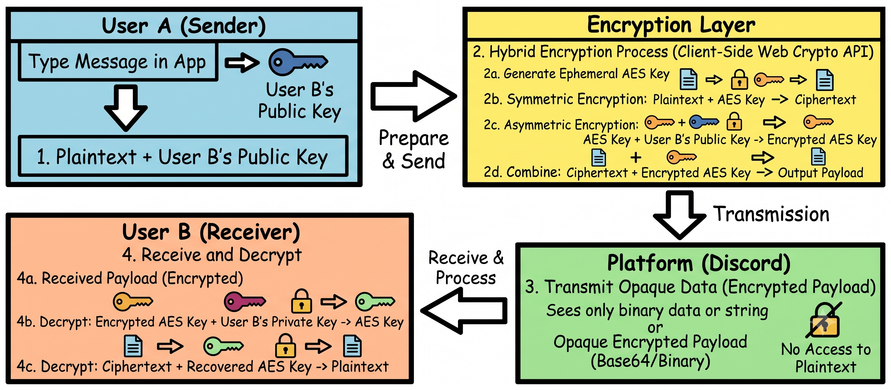

# NullOnyx

NullOnyx is a strictly client-side, self-hostable PWA that acts as a "bring your own encryption" layer for any text-based communication platform (Discord, Reddit, SMS).

## How the Encryption Works

NullOnyx never communicates with a backend server. All cryptographic operations happen entirely in your browser using the native Web Crypto API.

*   **Key Generation:** When you initialize NullOnyx, it generates an asymmetric key pair (Public and Private) locally. 
*   **Key Exchange:** You share your Public Key with your contact. They share theirs with you.
*   **Message Encryption:** When you type a message, NullOnyx generates a temporary symmetric key (AES-256-GCM) to encrypt the text. It then encrypts that AES key using your contact's Public Key.
*   **Decryption:** The recipient uses their local Private Key to decrypt the AES key, which then unlocks the original text message. To anyone else (including the platform hosting the chat), the message looks like random noise.

A image explaining workflow is given below(thanks gemini)



## Self-Hosting Guide

NullOnyx is designed to be deployed as a static export. While you can host it easily on Cloudflare Pages or GitHub Pages, you can also run it on your own hardware using Docker.

### Running with Docker

1. Clone this repository to your server.
2. Ensure Docker and Docker Compose are installed.
3. Build and run the container:

```bash
docker compose up -d --build
```

The application will be running at `http://localhost:3000`.
